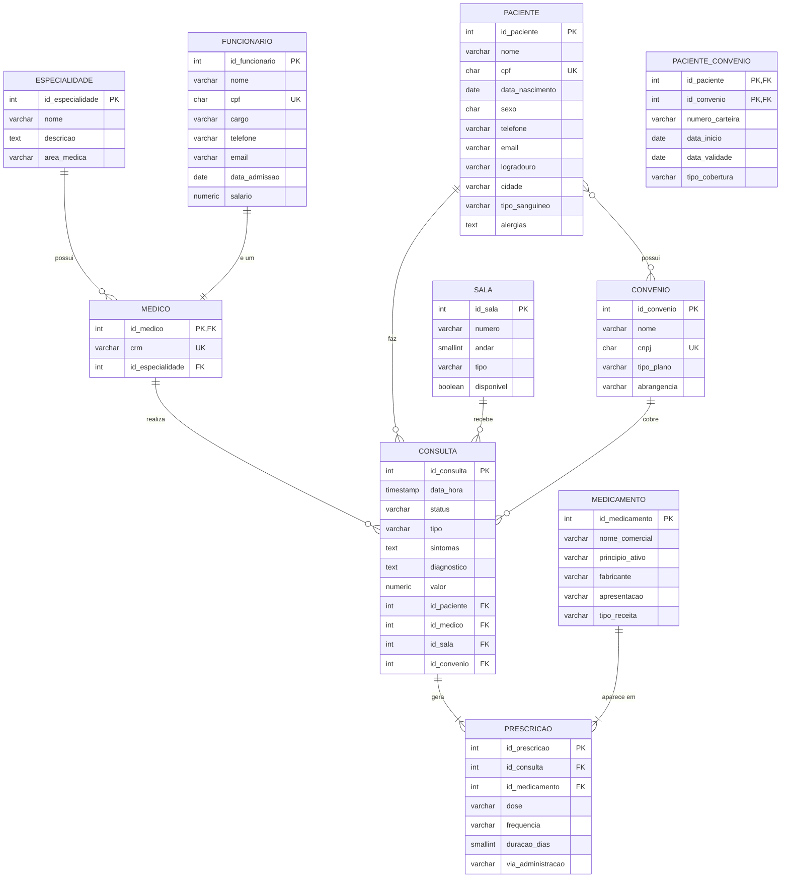

# DER — Diagrama Entidade-Relacionamento
## Sistema de Clínica Médica

## Relacionamentos

| Entidades | Tipo | Descrição |
|---|---|---|
| ESPECIALIDADE → MEDICO | 1:N | Uma especialidade pode ter vários médicos |
| FUNCIONARIO → MEDICO | 1:1 | Todo médico é um funcionário (herança) |
| PACIENTE → CONSULTA | 1:N | Um paciente pode ter várias consultas |
| MEDICO → CONSULTA | 1:N | Um médico pode realizar várias consultas |
| SALA → CONSULTA | 1:N | Uma sala pode receber várias consultas |
| CONVENIO → CONSULTA | 1:N | Um convênio pode cobrir várias consultas |
| CONSULTA ↔ MEDICAMENTO | N:N | Via entidade associativa PRESCRICAO |
| PACIENTE ↔ CONVENIO | N:N | Via entidade associativa PACIENTE_CONVENIO |
