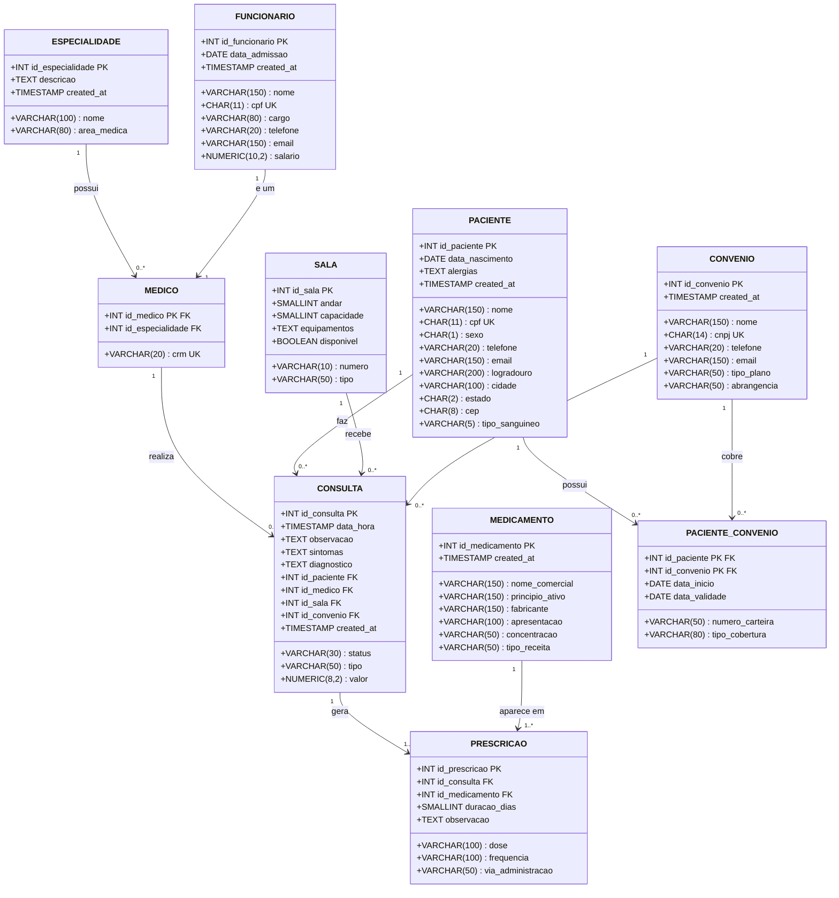

# MER — Modelo Entidade-Relacionamento
## Sistema de Clínica Médica

> Notação: **PK** = chave primária | **FK** = chave estrangeira | **UK** = único

---

## Representação Visual (Mermaid)



---

## Notação Relacional Formal

```
ESPECIALIDADE (
    <u>id_especialidade</u>,
    nome,
    descricao,
    area_medica,
    created_at
)

FUNCIONARIO (
    <u>id_funcionario</u>,
    nome,
    cpf*,
    cargo,
    telefone,
    email,
    data_admissao,
    salario,
    created_at
)

MEDICO (
    <u>id_medico</u> ───► FUNCIONARIO(id_funcionario),
    crm*,
    id_especialidade ───► ESPECIALIDADE(id_especialidade)
)

CONVENIO (
    <u>id_convenio</u>,
    nome,
    cnpj*,
    telefone,
    email,
    tipo_plano,
    abrangencia,
    created_at
)

SALA (
    <u>id_sala</u>,
    numero,
    andar,
    tipo,
    capacidade,
    equipamentos,
    disponivel
)

MEDICAMENTO (
    <u>id_medicamento</u>,
    nome_comercial,
    principio_ativo,
    fabricante,
    apresentacao,
    concentracao,
    tipo_receita,
    created_at
)

PACIENTE (
    <u>id_paciente</u>,
    nome,
    cpf*,
    data_nascimento,
    sexo,
    telefone,
    email,
    logradouro,
    cidade,
    estado,
    cep,
    tipo_sanguineo,
    alergias,
    created_at
)

CONSULTA (
    <u>id_consulta</u>,
    data_hora,
    status,
    tipo,
    observacao,
    sintomas,
    diagnostico,
    valor,
    id_paciente  ───► PACIENTE(id_paciente),
    id_medico    ───► MEDICO(id_medico),
    id_sala      ───► SALA(id_sala),
    id_convenio  ───► CONVENIO(id_convenio),
    created_at
)

PRESCRICAO (
    <u>id_prescricao</u>,
    id_consulta    ───► CONSULTA(id_consulta),
    id_medicamento ───► MEDICAMENTO(id_medicamento),
    dose,
    frequencia,
    duracao_dias,
    via_administracao,
    observacao,
    UNIQUE (id_consulta, id_medicamento)
)

PACIENTE_CONVENIO (
    <u>id_paciente</u> ───► PACIENTE(id_paciente),
    <u>id_convenio</u> ───► CONVENIO(id_convenio),
    numero_carteira,
    data_inicio,
    data_validade,
    tipo_cobertura
)
```

> Legenda: `<u>atributo</u>` = chave primária | `atributo*` = atributo único | `───►` = chave estrangeira

---

## Cardinalidades

| Relacionamento | Cardinalidade | Tipo |
|---|---|---|
| ESPECIALIDADE → MEDICO | (1,1) : (0,N) | 1:N |
| FUNCIONARIO → MEDICO | (1,1) : (1,1) | 1:1 (herança) |
| PACIENTE → CONSULTA | (1,1) : (0,N) | 1:N |
| MEDICO → CONSULTA | (1,1) : (0,N) | 1:N |
| SALA → CONSULTA | (1,1) : (0,N) | 1:N |
| CONVENIO → CONSULTA | (0,1) : (0,N) | 1:N (opcional) |
| CONSULTA ↔ MEDICAMENTO | (0,N) : (0,N) | N:N via PRESCRICAO |
| PACIENTE ↔ CONVENIO | (0,N) : (0,N) | N:N via PACIENTE_CONVENIO |
